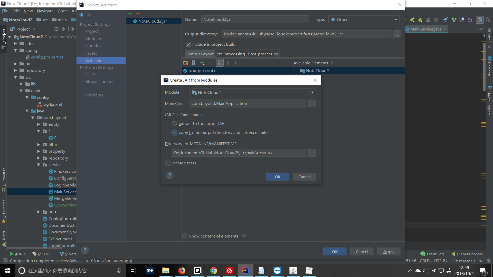
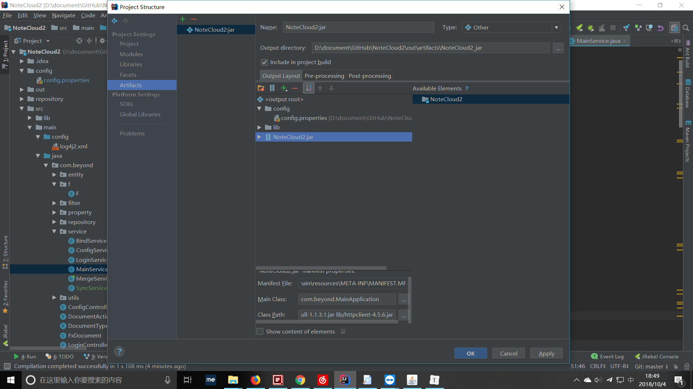

#### idea 打包

#### 打包后中文乱码

1. 启动jar时用命令启动: java -Dfile.encoding=UTF-8 -jar NoteCloud2.jar

   暂时只能用这种办法, 尝试了其他的都没有用

如果是spring boot 项目, 上边方法没有效果的话, 加上 --file.encoding=utf-8

### 本地暴露端口给外网访问

用 花生壳 , 内网穿透, 映射到内网