### 内存

- 运行时内存
  - 方法区
    - 保存类的信息, 常量, 静态变量, 即时编译后的代码
    - 常量池: 符号引用,  String.intern()
  - 虚拟机栈 - 线程
    - 栈帧: 局部变量表(Slot), 操作栈, 动态链接, 方法出口
  - 本地方法栈 - 线程
  - 堆
    - 存放对象
    - 新生代, 老年代
    - eden, from survivor, to survivor
  - 程序计数器 - 线程
  - 直接内存
- 对象访问
  - 句柄
    - 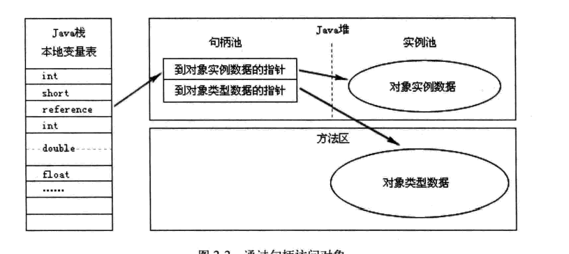
  - 直接引用 *
    - 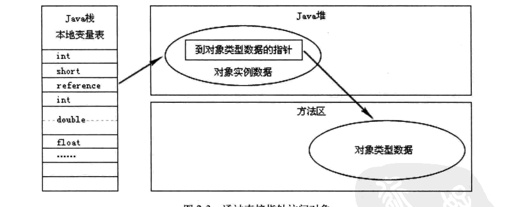
- OutOfMemory  内存泄漏, 大对象
- StackOverFlow 栈帧过大, 栈容量太小- 递归
- 常量池溢出 String.intern()
- 方法区溢出 动态代理, jsp
- 直接内存溢出 直接内存不包括在堆里, 所以堆内存不要太大

### 垃圾回收

- 那些需要回收: 引用计数, GC roots - 栈中的本地变量表直接引用的对象, 静态属性对象, 常量引用对象, JNI引用对象
- 引用: 强引用, 软引用-内存不够才回收, 弱引用-有GC就回收, 虚引用

- 算法

  - 新生代 复制算法
  - 老年代 标记清除, 标记整理

- 垃圾回收器

  - Serial - 新生代

  - Serial Old

  - ParNew - 新生代

  - CMS - 老年代  尽量减少停止时间

    - 初始标记 - stop the world -只标记GC roots

    - 并发标记

    - 重新标记 - stop the world - 标记漏网的

    - 并发清除

    - 缺点: 

      1. 不能清除float garbage, 需要额外的空间来保存清理期间产生的垃圾, 如果空间不够, 会进行一次Full GC.

      2. 会产生内存碎片

  - Parallel Scavenge  - 新生代  可控吞吐量

    - 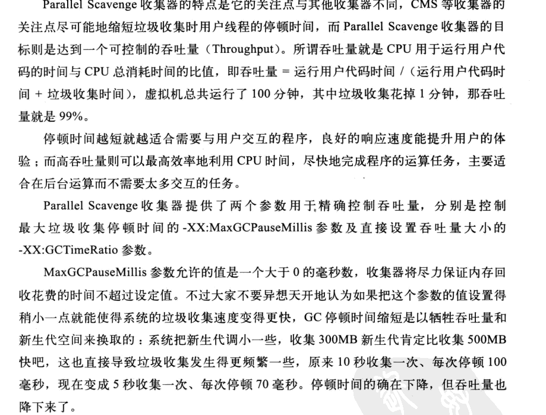

  - Parallel Old

  - G1 标记整理 分块, 优先清理垃圾多的块 

    - 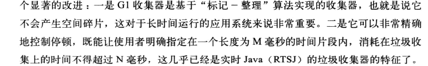

- 对象分配

  - 优先在Eden上分配
  - 空间不够直接进入老年代
  - 年龄大的对象进入老年代
  - 空间分配担保
    - 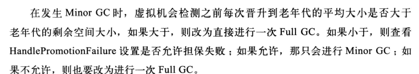

### Class文件

- 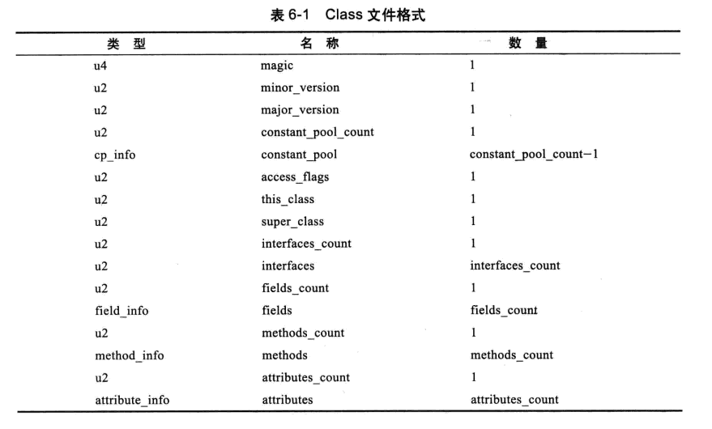

- 常量池

  - 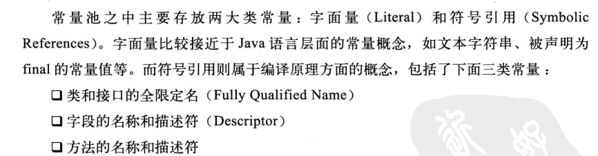
  - 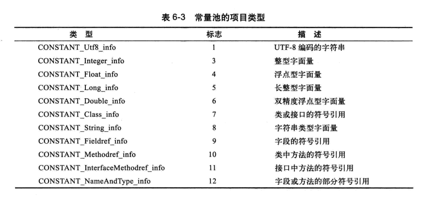

- 字段表(field_info)

  - 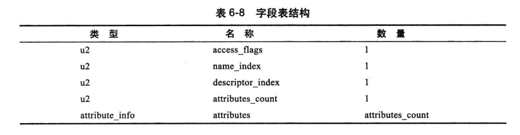
  - attributes 里面可能会保存字段的值: 

- 方法表(method_info)

  - 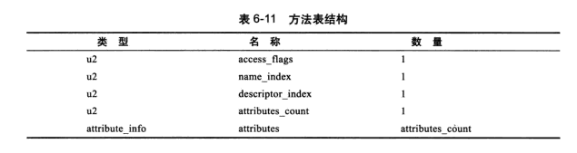

  - attributes里面可能保存着

    

    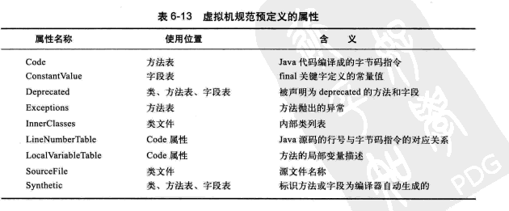

    这里面 Code 代表着方法中的代码: 包括max_stack, max_locals 这些实在编译的时候就确定的. 还有 code : 代表着一组指令, exception_info  控制try-catch-finally 的跳转

    

    lineNumberTable 源码行号和code行号的对应关系

    LocalVariableTable 源码中参数名称和局部变量表中的对应关系

    Exceptions throws出来的那些异常

    

    java 1.5 新增了 LocalVariableTypeTable 用来表示泛型类型的

    