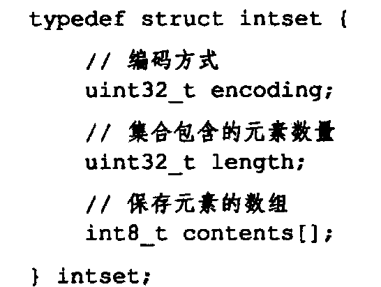
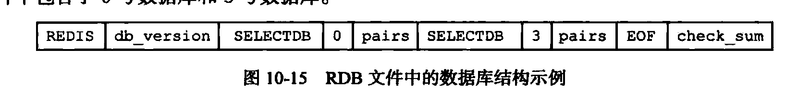

### 字符串

底层: 包装 C 语言的字符串


- 修改时内存重新分配, 为了减少内存分配次数, 会预分配, 分配后的大小都是 2^n(满足条件的最小2^n)
- 删除时不释放多余空间
- 二进制安全

  

### 链表(list)

- 
- 双向链表

### 字典(hash)

- 
- 根据hash算法算出hash值, 然后再根据sizemask 算出下标
- 
- type 用来保存一系列操作键值对, 计算hash 的函数
- ht[2] 是个两个hashtable, 之所以用两个是因为在扩容的时候要rehash, ht[0] 会渐进式的转移到 h[1] . 如果期间有什么操作, 会操作在h[0] 上, 顺便转移到h[1], 如果新增就都放到ht[1]里面.
- 解决hash冲突与hashmap 类似, 放到链表的头一个
- 扩容也是按2^n 的方式来的

### 有序集合 ZSET

- 采用跳跃表实现: https://lotabout.me/2018/skip-list/
- 


- 按分值排序

### 整数集合

- 
- encoding 是表明用的多大空间 int16/int32/int64
- content 用来保存元素
- 升级: 分配空间 - 向后移动元素
- 不支持降级

### 压缩列表

- 目的是为了节省内存空间, 一般都是在元素比较少(256), 字符串长度比较小(64个字节)
- 
- entry:
- previous_entry_length 会分为 1字节和5字节, 因此增加个大entry的时候, 可能会因为 previous_entry_length 字节的扩大而产生连锁扩大, 不过一般几率比较小, 而且性能影响不大

### 对象

- 上边都是数据结构, redis会对上边的进行进一步的封装, 封装成object , 5 种

- 各个数据结构在满足一定条件后可以进行转换

- 里面有个encoding 表明用什么数据结构存储, type表明是什么object

- 用count reference 记录引用, 用来进行垃圾回收

- 有序集合用跳表的时候会增加一个字典来标识 键值对的映射, 这样可以让查键值对的复杂度编程O(1)

- 对象共享, count reference +1 , 让对象指向同一个

- 启动会创建10000个int对象用来共享 , 从1-9999

- 空转时长 LRU策略


### 数据库

- redisServer 中有个 db 数组 和 dbnum
- 默认db数组大小为 16 
- 可以通过select 切换 db
- 切换的时候只是 client 指向数组不同的地方
- 键空间: 可以通过``` subscribe __keyspace@0__:message ``` 对message 这个键进行监控, 可设置
- pub/sub : 可以监控一个channel, 如: subscribe msg / publish msg yes
- expire , ttl : 实现原理: 在db中保存着一个 dict, key-timestamp
- 过期键删除策略: 定时删除, 惰性删除, 定期删除
- 持久化时过期键的策略: 主从模式只能由主删除( 保持一致性), 其他情况下 RDB 的方式不会保存过期的, AOF 会增加一个DEL 语句

### RDB 持久化

- 快照

- 在未开启aof的情况下由RDB恢复数据

- save 阻塞  bgsave 异步

- 载入 阻塞

- 自动间隔性保存

- dirty 计数器, lastsave: 未刷入磁盘的数据叫 dirty 的数据, 在上一次刷盘之前, 每进行一次修改操作, dirty 计数器就会 + 1, 刷了之后reset

- RDB 文件结构

  




保存具体数据时根据encoding不同, 比较复杂, 看书吧


### AOF 持久化

- aop_buf

- 写入, 刷到磁盘

- appendfsync: 操作系统为了性能, 一般会在写入时不会直接写入磁盘, 而是先写到缓存, 到达一定程度在写到磁盘, 这个参数就是控制什么时候写到磁盘

  always, everysec, no

  always 每次都写, 效率较低

  everysec 每秒写一次

  no 操作系统控制

- aof重写: 根据数据库现在的状态写出一个精简版的aof文件, 然后替换掉原来的文件

- aof重写期间的数据: 放到 aof重写缓存, 在重写完成之后吧重写缓存里面的合并到aof文件中

  

  