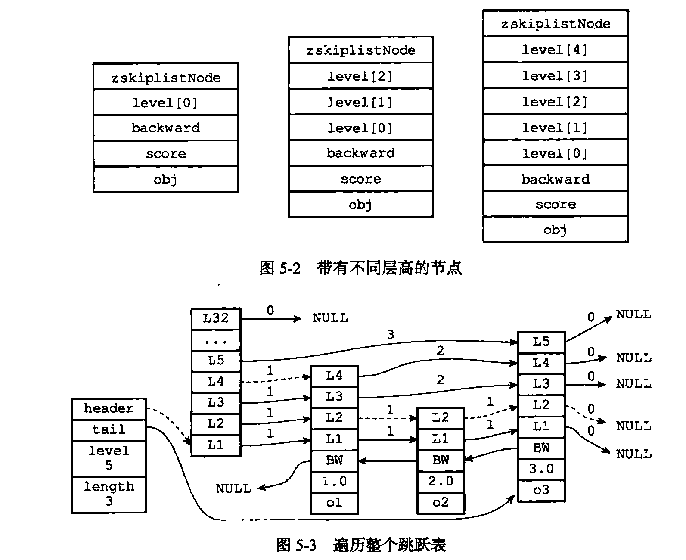

### 字符串

底层: 包装 C 语言的字符串


- 修改时内存重新分配, 为了减少内存分配次数, 会预分配, 分配后的大小都是 2^n(满足条件的最小2^n)
- 删除时不释放多余空间
- 二进制安全

  

### 链表(list)

- 
- 双向链表

### 字典(hash)

- 
- 根据hash算法算出hash值, 然后再根据sizemask 算出下标
- 
- type 用来保存一系列操作键值对, 计算hash 的函数
- ht[2] 是个两个hashtable, 之所以用两个是因为在扩容的时候要rehash, ht[0] 会渐进式的转移到 h[1] . 如果期间有什么操作, 会操作在h[0] 上, 顺便转移到h[1], 如果新增就都放到ht[1]里面.
- 解决hash冲突与hashmap 类似, 放到链表的头一个
- 扩容也是按2^n 的方式来的

### 有序集合 ZSET

- 采用跳跃表实现: https://lotabout.me/2018/skip-list/
- 


- 按分值排序

### 整数集合

- 
- encoding 是表明用的多大空间 int16/int32/int64
- content 用来保存元素
- 升级: 分配空间 - 向后移动元素
- 不支持降级

### 压缩列表

- 目的是为了节省内存空间, 一般都是在元素比较少(256), 字符串长度比较小(64个字节)
- 
- entry:
- previous_entry_length 会分为 1字节和5字节, 因此增加个大entry的时候, 可能会因为 previous_entry_length 字节的扩大而产生连锁扩大, 不过一般几率比较小, 而且性能影响不大

### 对象

- 上边都是数据结构, redis会对上边的进行进一步的封装, 封装成object , 5 种

- 各个数据结构在满足一定条件后可以进行转换

- 里面有个encoding 表明用什么数据结构存储, type表明是什么object

- 用count reference 记录引用, 用来进行垃圾回收

- 有序集合用跳表的时候会增加一个字典来标识 键值对的映射, 这样可以让查键值对的复杂度编程O(1)

- 对象共享, count reference +1 , 让对象指向同一个

- 启动会创建10000个int对象用来共享 , 从1-9999

- 空转时长 LRU策略


### 数据库

- redisServer 中有个 db 数组 和 dbnum
- 默认db数组大小为 16 
- 可以通过select 切换 db
- 切换的时候只是 client 指向数组不同的地方
- 键空间: 可以通过``` subscribe __keyspace@0__:message ``` 对message 这个键进行监控, 可设置
- pub/sub : 可以监控一个channel, 如: subscribe msg / publish msg yes
- expire , ttl : 实现原理: 在db中保存着一个 dict, key-timestamp
- 过期键删除策略: 定时删除, 惰性删除, 定期删除
- 持久化时过期键的策略: 主从模式只能由主删除( 保持一致性), 其他情况下 RDB 的方式不会保存过期的, AOF 会增加一个DEL 语句

### RDB 持久化

- 快照

- 在未开启aof的情况下由RDB恢复数据

- save 阻塞  bgsave 异步

- 载入 阻塞

- 自动间隔性保存

- dirty 计数器, lastsave: 未刷入磁盘的数据叫 dirty 的数据, 在上一次刷盘之前, 每进行一次修改操作, dirty 计数器就会 + 1, 刷了之后reset

- RDB 文件结构

  


保存具体数据时根据encoding不同, 比较复杂, 看书吧


### AOF 持久化

- aop_buf

- 写入, 刷到磁盘

- appendfsync: 操作系统为了性能, 一般会在写入时不会直接写入磁盘, 而是先写到缓存, 到达一定程度在写到磁盘, 这个参数就是控制什么时候写到磁盘

  always, everysec, no

  always 每次都写, 效率较低

  everysec 每秒写一次

  no 操作系统控制

- aof重写: 根据数据库现在的状态写出一个精简版的aof文件, 然后替换掉原来的文件

- aof重写期间的数据: 放到 aof重写缓存, 在重写完成之后吧重写缓存里面的合并到aof文件中

  

- 恢复的时候是弄了一个 fake client

### 事件

- 文件事件: 类似于 java nio
- 时间事件: serverCron 默认每 100 ms 执行一次
- 会维护一个时间时间的链表, 在循环的时候会找离现在最近的还没有执行的事件, 然后根据它的时间休眠到该通知的点, 然后执行

### 客户端

- 保存客户端连接的信息: socket(伪客户端 为-1, 其他为整数) 
- 输入缓存
- 输出缓存: 有两个, 一个固定一个可变, 回复信息小的时候用固定的
- 在一定条件下客户端会被关闭: 超时, 传入信息过大(硬限制, 软限制)

### 复制

- 2.8之前, 如果没同步过, 则发送RDB文件, 进行全量同步. 之后进行命令传播的方法实时同步

- 缺陷: 断线之后依然是全量同步

- 2.8之后, 维护一个复制积压缓存, FIFO 的定容量的循环数组, 保存近期的命令byte, 从服务器会发送offset来检查自己和主服务器是不是一致, 如果不一致就从数组中取, 如果数组中没有相应的offset, 就进行全量同步

- 复制步骤: 

  - 设置主服务器的地址和端口
  - 建立 socket 连接
  - ping 一下 , 检查是否能连接
  - 身份验证
  - 向主服务器发送自己的端口
  - 同步 PSYNC
  - 命令传播

- 主服务器和从服务器互为对方的客户端

- info replication 可以查看复制的角色和其他信息

- 心跳检查: 

  - REPLCONF ACK 检查网络连接是否正常, offset也是用这个发的
  - min-slaves 配置可以设置最少的slave数量和最大slave延迟(如果延迟秒数过多就认为是断了), 如果slave 状态不对, 就不进行下面的命令了
  - 检测命令丢失


### 集群

- 分片, 将keys 分配到 2048*8个 slot 里面, 然后nodes 瓜分这些slots

- clusterNode clusterState clusterLink  结构

- 添加node : cluster meet <host> <port>

- 槽指派: cluster addslots ....  这里比较坑的是要一个一个写, for循环的方式还没搞懂怎么写

  可以修改生成出来的 nodes.config : 0-1000

- 每个节点知道所有的slot 对应node 的信息, 还有slot key对应的跳表, 可以根据spot查询所有key

- 执行命令时, 如果当前分区中有相应的key 就自己处理, 如果没有则返回MOVED错误重定向处理

- 重新分片: 重新分片会对spot进行迁移, 如果迁移过程中访问相应的key, 如果还没迁移过去会返回ASK错误, 然后重定向处理

- 设置从节点 cluster replicate <node_id>

- 故障检测: 每个节点定期ping, 如果检测到某个节点超时, 就标记为疑似下线. 同时其他节点会广播自己发现的疑似下线的report, 此时这个节点就会记录下来, 如果半数以上认为下线了, 那就下线了

- 故障转移: 选举新的主节点: 所有主节点只有一票, 故障的主节点的从节点发送选举信息, 其他主节点会给第一个收到的从节点投票, 超过半数的当选.

  类似于哨兵机制

- 消息: 集群publish的时候, 一个node 发送, 其他节点也会发送

  协议: Gossip

### 发布订阅

- PSUBSCRIBE : Pattern
- PUBSUB CHANNELS <pattern>
- PUBSUB NUMSUB
- PUBSUB NUMPAT

### 事务

- Multi Exec
- Watch : 乐观锁, 如果监视的key变化了就打开REDIS_DIRTY_CAS ,  然后事务就失败了, 返回空
- 实现是每个client都有一个事务状态的结构, 里面会把事务中的命令放到一个FIFO的队列里面, 执行的时候依次执行

